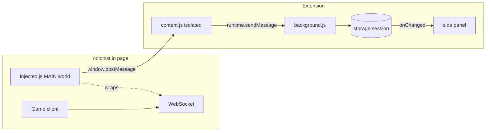

# Colonist Game Analyst

Chrome extension that provides a **read-only analyst side panel** while you play [colonist.io](https://colonist.io). The first milestone is a **live WebSocket event log** (client send/receive) so you can study the game’s wire protocol and later add real analytics: board state, production odds, trade fairness, robber tracking, etc.

## Architecture

| Piece | Role |
|--------|------|
| `injected.js` | Patches `WebSocket` with `Reflect.construct` so `instanceof WebSocket` still holds; emits `ws-open`, `ws-send`, `ws-message`. |
| `content.js` | Injects the script, listens for `postMessage`, forwards to the service worker. |
| `background.js` | Appends events to a ring buffer in `chrome.storage.session` (MV3-side-panel-friendly). |
| Side panel | Renders the buffer; pause/clear controls for inspection. |

## Load in Chrome

1. Open `chrome://extensions`.
2. Enable **Developer mode**.
3. **Load unpacked** → choose the `extension` folder inside this repo.

On a colonist.io tab, click the extension icon to open the **side panel** (Chrome 114+). Join or start a game; you should see socket traffic in the log.

## Roadmap

1. **Protocol decode** — Identify message types in captured frames; map to turns, trades, dice, board layout.
2. **Derived stats** — Resource EV on hexes, port valuation, opponent hand inference bounds (where the rules allow).
3. **Persistence** — Optional export (JSON) of a single match for offline analysis.

## Compliance

This tool is intended for **personal analysis** of openly visible client traffic (same as DevTools). Automated play, botting, or anything that violates [Colonist’s Terms of Service](https://colonist.io/) is out of scope. Use at your own risk and stop if the platform asks you to.

## License

See [LICENSE](LICENSE).
